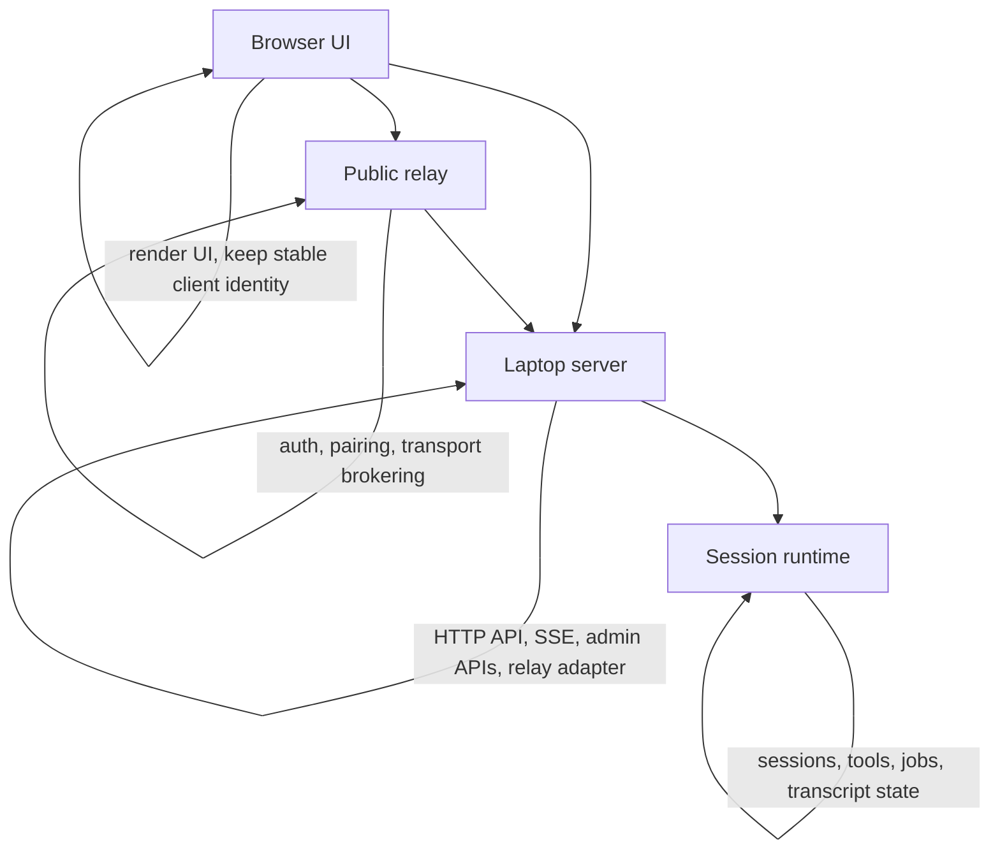

# Part 1: System Overview

## 1. The Three Main Runtime Pieces

### `apps/web`

This is the browser UI.

It can run in two different deployment modes:

- **local web UI**: opened from the laptop and talking directly to `apps/server`
- **remote web UI**: hosted publicly and talking to `apps/relay-server`

The web app is mostly a transport and presentation layer. It does not own chat session execution.

### `apps/server`

This is the real application backend on the user's laptop.

It owns:

- browser client registration
- session state and transcript state
- chat request handling
- tool execution
- MCP server management
- scheduled jobs
- local admin APIs
- provider login and local configuration

If you want to understand where app behavior really happens, this is the most important runtime.

### `apps/relay-server`

This is the public relay.

It owns:

- Better Auth and Google OAuth at `/api/auth/*`
- issuing relay auth tokens for browser clients and laptop agents
- owner-to-agent linking
- keeping live browser and agent transport maps in memory
- forwarding traffic between remote browsers and the laptop server

It does **not** own the chat runtime.

## 2. Shared Contract

`apps/shared` defines the cross-app protocol.

Important shared routes include:

- `CLIENT_EVENT_STREAM_PATH`
- `CLIENT_MESSAGE_PATH`
- `RELAY_CLIENT_AUTH_PATH`
- `RELAY_CLIENT_HEARTBEAT_PATH`
- `RELAY_AGENT_OWNER_GRANT_PATH`
- `RELAY_AGENT_AUTH_PATH`
- `RELAY_AGENT_STREAM_PATH`
- `RELAY_AGENT_MESSAGE_PATH`
- `RELAY_CONNECTION_PATH`

Important shared relay message types include:

- `RelayAgentCommand`
- `RelayAgentMessage`

That shared package is what keeps the browser, laptop server, and relay on one explicit wire contract.

## 3. Local Mode vs Remote Mode

The system has two user-facing runtime paths.

### Local mode

In local mode:

- the browser sends `GET /api/client/stream` and `POST /api/client/message` directly to `apps/server`
- the browser identifies itself with a local `clientId`
- the laptop server authenticates that browser using a local auth cookie
- the relay is still involved for owner linking, but it is not in the live chat path

### Remote mode

In remote mode:

- the browser talks only to the relay for transport
- the relay authenticates the browser and resolves which laptop agent it should target
- the laptop server keeps an outbound SSE stream open to the relay
- chat traffic is forwarded across the relay instead of opening any inbound connection to the laptop

## 4. Why The Relay Exists

The laptop server is usually on a private machine and often not publicly reachable.

That makes direct remote browser → laptop connections unreliable or impossible.

The relay fixes that by reversing the direction of connectivity:

- the laptop server dials out to the relay
- the remote browser dials out to the relay
- the relay forwards between already-open authenticated channels

This means the public surface is stable even though the real backend runs on the user's laptop.

## 5. Runtime Ownership Boundaries

The important mental model is:

- **browser** = UI and thin client transport
- **relay** = public auth and message broker
- **server** = real backend

## 6. Core State By Component

### Browser state

The browser persists only stable client identity, not the full backend session runtime.

Examples:

- remote browser identity in `window.localStorage` via `apps/web/src/relay-auth.ts`
- local browser client id in browser storage via `apps/web/src/local-client.ts`

### Relay state

The relay keeps two kinds of state:

#### Durable

- owner-to-agent bindings in a JSON file via `apps/relay-server/src/owner-binding-store.ts`

#### In memory only

- active browser streams
- active agent streams
- active agent auth sessions used for readiness checks

### Laptop server state

The laptop server owns the app state that matters to the product:

- chat sessions
- transcripts
- local auth cookie state for the laptop browser
- provider config
- MCP config
- scheduled jobs
- append system prompt state
- tool inventory

## 7. What Happens On Startup

### Browser startup

The web app chooses either `createLocalWebRuntime()` or `createRemoteWebRuntime()` in `apps/web/src/runtime.ts`.

### Laptop server startup

`runWebServer()` in `apps/server/src/web/index.ts`:

1. loads local session and tool state
2. initializes relay auth state
3. starts the HTTP server
4. starts the relay transport loop when relay auth is already available
5. exposes local browser APIs and admin APIs

### Relay startup

`runRelayServer()` in `apps/relay-server/src/index.ts`:

1. creates relay state
2. initializes the owner binding store
3. creates the HTTP server
4. serves auth, transport, health, and connection-check endpoints
