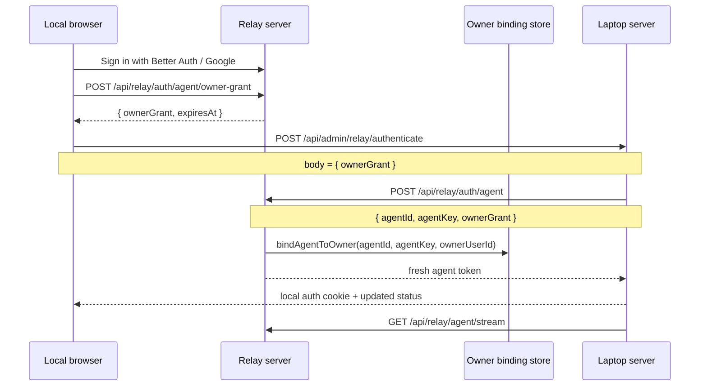
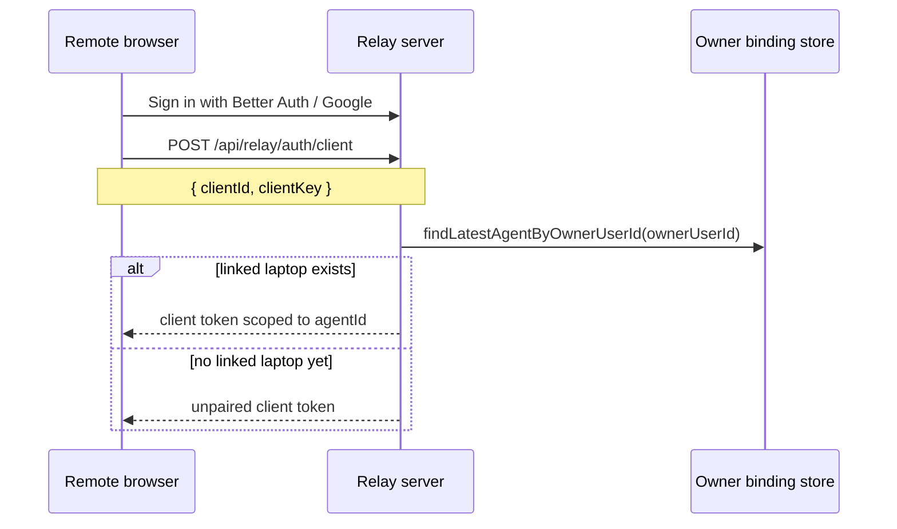

# Part 2: Auth, Linking, And Runtime Modes

## 1. Four Different Identity Layers

The app uses four different kinds of identity that are easy to mix up.

### Browser client identity

This is the durable browser-side identity used for transport.

For remote mode it is stored in the browser by `apps/web/src/relay-auth.ts` as:

- `clientId`
- `clientKey`

For local mode the browser also keeps a local client id.

These identities are stable across refreshes so the browser can ask for new transport credentials without becoming a brand-new logical client every time.

### Laptop agent identity

The laptop server has its own durable relay identity in `apps/server/src/relay-auth.ts`.

That file persists:

- `agentId`
- `agentKey`

to `~/.apreal/agent/relay-auth.json`.

The laptop server reuses those durable values whenever it needs a fresh relay token.

### Owner identity

The owner identity is the signed-in Better Auth user id on the relay.

That owner identity is what links:

- a remote browser session
- a local browser session on the laptop
- the laptop server agent identity

In product terms, this is the account-level pairing key.

### Short-lived transport credentials

The relay issues short-lived JWTs for actual transport access.

Those JWTs are for:

- remote browser clients
- laptop agents
- owner grants used during laptop linking

The durable identities survive longer than the JWTs. The JWTs are just the current authenticated transport tickets.

## 2. What Is Persisted Where

| State | Stored by | Persistence |
| --- | --- | --- |
| `clientId` + `clientKey` | browser | `localStorage` |
| `agentId` + `agentKey` | laptop server | `~/.apreal/agent/relay-auth.json` |
| owner-to-agent binding | relay | JSON file via `RelayOwnerBindingStore` |
| local browser auth session | laptop server | signed HTTP-only cookie |
| relay client token | browser | not persisted |
| relay agent token | laptop server | not persisted |

That last point matters: the system persists stable identities, not long-lived transport tokens.

## 3. Laptop Linking Flow

The laptop server becomes linked to an owner account through a browser running on the laptop.

This happens across both the relay and the local server.

### Step-by-step

1. The user signs in to the relay's Better Auth session in the browser.
2. The browser calls `POST /api/relay/auth/agent/owner-grant` on the relay.
3. The relay returns a short-lived signed `ownerGrant` tied to that Better Auth user id.
4. The browser calls `POST /api/admin/relay/authenticate` on the local server with that `ownerGrant`.
5. The local server calls `POST /api/relay/auth/agent` with its durable `agentId` and `agentKey` plus the owner grant.
6. The relay verifies the grant and writes the owner-to-agent binding.
7. The relay returns a fresh agent JWT.
8. The local server stores the durable identity, keeps the issued agent token in memory, and starts or restarts the outbound relay transport.
9. The local server sets a local auth cookie for the browser on the laptop.

## 4. Laptop Linking Sequence

## 5. Remote Browser Auth Flow

When a remote browser wants to chat through the relay, it does not talk to the laptop directly.

Instead it asks the relay for browser auth.

### Step-by-step

1. The hosted browser keeps or creates a stable `clientId` and `clientKey`.
2. It calls `POST /api/relay/auth/client`.
3. The relay resolves the owner from the Better Auth session cookie on that browser request.
4. The relay looks up the latest bound agent for that owner.
5. If a laptop is linked, the relay issues a client token scoped to that `agentId`.
6. If no laptop is linked, the relay still issues a client token, but it is unpaired.
7. The browser uses that token for `GET /api/client/stream` and `POST /api/client/message` against the relay.

## 6. Remote Pairing Sequence

## 7. Local Browser Auth Flow

The browser running on the laptop talks directly to `apps/server` for chat transport, but it still uses the relay to bootstrap ownership.

`ensureLocalBrowserAuthSession()` in `apps/web/src/local-auth.ts` does this:

1. ask the local server whether a local auth cookie already exists
2. if not, request an owner grant from the relay
3. send that owner grant to the local server admin endpoint
4. receive a local auth cookie from the laptop server
5. use that cookie for local browser access after that

So local mode and remote mode share the same account-linking concept even though their live chat transport is different.

## 8. Connection Authorization For Remote Traffic

The laptop server does not blindly trust a browser token just because it looks valid.

When a remote browser request reaches the laptop server through the relay path, the laptop server uses `verifyRelayClientAccess()` to ask the relay:

- who this token belongs to
- whether it is allowed to target this exact `agentId`

That check is exposed by `POST /api/relay/connection`.

This keeps target scoping enforced by the relay rather than duplicated loosely on the laptop.

## 9. Runtime Modes Compared

| Topic | Local mode | Remote mode |
| --- | --- | --- |
| Browser talks to | `apps/server` | `apps/relay-server` |
| Live SSE stream goes to | laptop server | relay |
| Browser auth proof | local auth cookie | Better Auth session + relay client JWT |
| Message uplink | `POST /api/client/message` on laptop server | `POST /api/client/message` on relay |
| Message downlink | `GET /api/client/stream` on laptop server | `GET /api/client/stream` on relay |
| Relay used in chat path | no | yes |

## 10. Important Constraint

The source of truth for pairing is the owner-to-agent binding on the relay, not the presence of any one issued JWT.

So the durable model is:

- account signs in
- laptop agent gets bound to that account
- clients authenticated as that account get scoped to the bound agent

Then the live model is:

- browser and laptop server both obtain short-lived tokens
- browser and laptop server connect their transports
- relay forwards traffic while both sides stay connected
