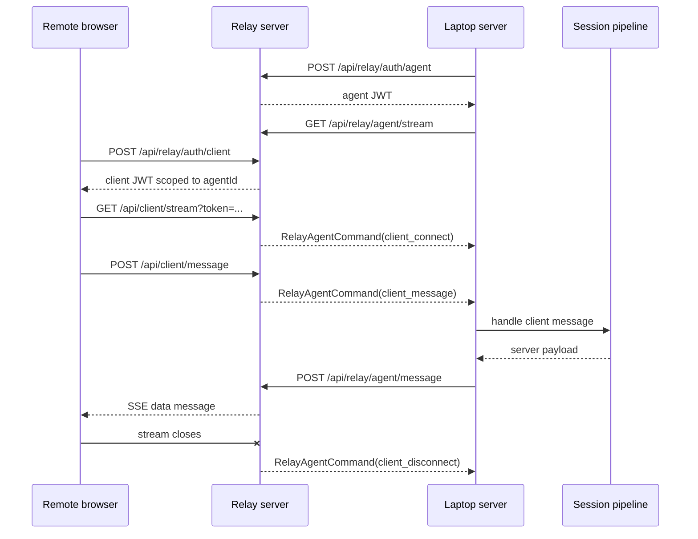
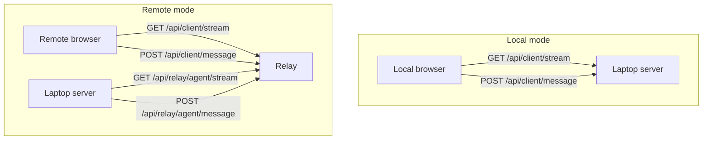

# Part 3: End-To-End Flows

## 1. Remote Chat Flow

Remote chat is the most important cross-service path in the system.

At a high level:

1. the laptop server authenticates with the relay and opens an SSE stream
2. the remote browser authenticates with the relay and opens its own SSE stream
3. browser messages go up to the relay with HTTP POST
4. the relay forwards those messages to the laptop server over the agent SSE stream
5. the laptop server runs normal session logic
6. server responses are posted back to the relay
7. the relay pushes them down to the browser SSE stream

## 2. Remote Chat Sequence

## 3. Where The Real App Logic Starts

The relay forwards transport events, but the actual app logic starts in `apps/server`.

In `apps/server/src/web/relay.ts`:

- `handleRelayAgentCommand()` receives relay commands
- `ensureRelayClientConnection()` makes the remote client look like a normal server-side client connection
- `handleClientMessage()` is where the forwarded browser message enters the server's normal message pipeline

That design is important because it means the laptop server does not maintain one code path for local chat and a completely separate one for remote chat.

Instead the relay path adapts remote traffic into the same client/session machinery already used by the local server.

## 4. Local Chat Flow

Local chat is much simpler because the browser talks directly to the laptop server.

### Step-by-step

1. the local browser opens `GET /api/client/stream` on the laptop server
2. the laptop server registers a local HTTP client connection
3. the browser sends `POST /api/client/message` to the laptop server
4. the laptop server handles the message directly
5. the laptop server writes server payloads back on the same browser SSE stream

## 5. Local vs Remote Transport Diagram

## 6. Readiness In The Remote UI

The remote browser does not just ask whether an account is paired. It also asks whether the laptop server is currently reachable.

`readRelayClientHeartbeat()` reads two booleans from the relay:

- `serverReady`
- `transportReady`

### `serverReady`

This means the relay has a non-expired in-memory agent auth session for the targeted laptop agent.

In other words, the laptop has authenticated recently enough for the relay to consider it known.

### `transportReady`

This means the laptop server currently has a live relay agent SSE stream connected.

In other words, the browser could actually deliver traffic right now.

### Why that distinction matters

- `serverReady = true`, `transportReady = false` means the laptop is linked, but the live relay transport is down.
- both false usually means there is no currently usable linked server for this browser session.

## 7. Reconnect Behavior

### Laptop server reconnects

The laptop server runs a reconnect loop in `runRelayTransportLoop()`.

If the relay SSE stream ends:

1. relay-backed clients are removed from the laptop server's client map
2. the laptop waits `RELAY_STREAM_RETRY_MS`
3. the laptop reconnects to the relay
4. the relay replays `client_connect` for any browser streams still attached to that agent

### Browser reconnects

If a browser reconnects with the same `clientId`, the active stream for that client is replaced.

This is true both:

- on the relay for remote browser streams
- on the laptop server for direct local browser streams

## 8. Failure Propagation

### If a remote browser stream closes

- the relay removes that browser connection
- the relay sends `client_disconnect` to the laptop server
- the laptop server removes its corresponding relay-backed client

### If the laptop relay stream closes

- the relay removes the agent connection
- the relay closes every browser stream targeting that agent
- remote browsers must reconnect later after the laptop transport returns

### If local browser SSE closes

- the laptop server removes that local client directly
- no relay cleanup is needed because the relay is not in the live path

## 9. A Good Mental Model

The cleanest way to think about the system is:

- the browser always speaks **HTTP for uplink** and **SSE for downlink**
- the laptop server always owns the actual session runtime
- the relay exists only to make the remote path work securely and reliably without requiring inbound access to the laptop
