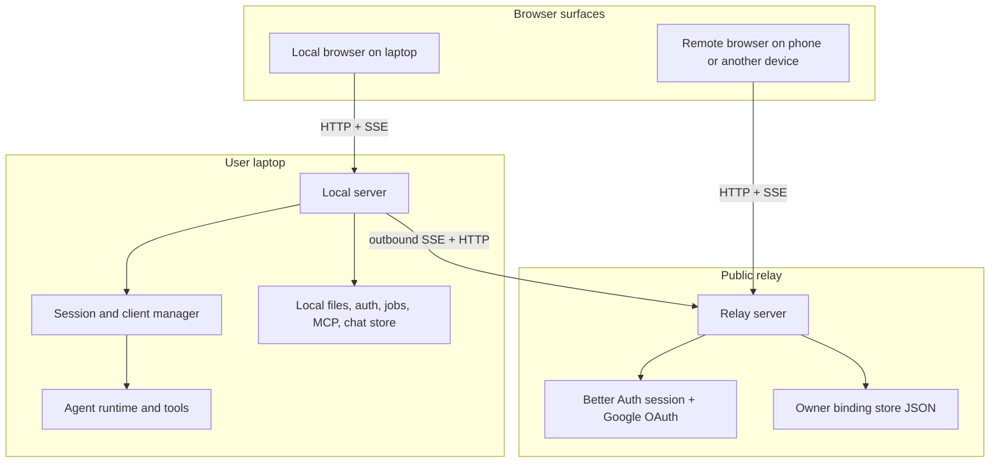

# App Architecture

This document set explains how the app works across the three main runtime pieces:

- `apps/web`: the browser client
- `apps/server`: the local server that runs on the user's laptop
- `apps/relay-server`: the public relay that authenticates and forwards remote traffic

It is based on the current implementation in:

- `apps/web/src/runtime.ts`
- `apps/web/src/relay-auth.ts`
- `apps/web/src/local-auth.ts`
- `apps/server/src/web/index.ts`
- `apps/server/src/web/web-request-handler.ts`
- `apps/server/src/web/relay.ts`
- `apps/server/src/relay-auth.ts`
- `apps/relay-server/src/index.ts`
- `apps/relay-server/src/relay/routes.ts`
- `apps/relay-server/src/relay/transports.ts`
- `apps/relay-server/src/owner-binding-store.ts`
- `apps/shared/src/index.ts`

## Reading Order

1. `01-system-overview.md`
2. `02-auth-linking-and-runtime-modes.md`
3. `03-end-to-end-flows.md`

## One-Screen Summary

The app has one real backend runtime: `apps/server` on the user's laptop.

The browser UI can talk to that server in two ways:

1. **Local mode**: the browser talks directly to the laptop server over HTTP and SSE.
2. **Remote mode**: the browser talks to the public relay, and the relay forwards traffic over an outbound authenticated SSE connection that the laptop server keeps open.

So the relay is not the agent runtime. It is the public edge service that:

- authenticates browser users with Better Auth
- links a signed-in browser and a signed-in laptop server to the same owner account
- issues short-lived relay JWTs to browser clients and laptop agents
- forwards client messages and server messages between them

The laptop server still owns:

- sessions
- transcripts
- tool execution
- MCP integration
- jobs
- provider login and local settings

## High-Level Topology

## Naming Note

Some existing code and older docs still use the term **Pi server**. In the current product framing, that is the same runtime as the **local server on the user's laptop** in `apps/server`.
