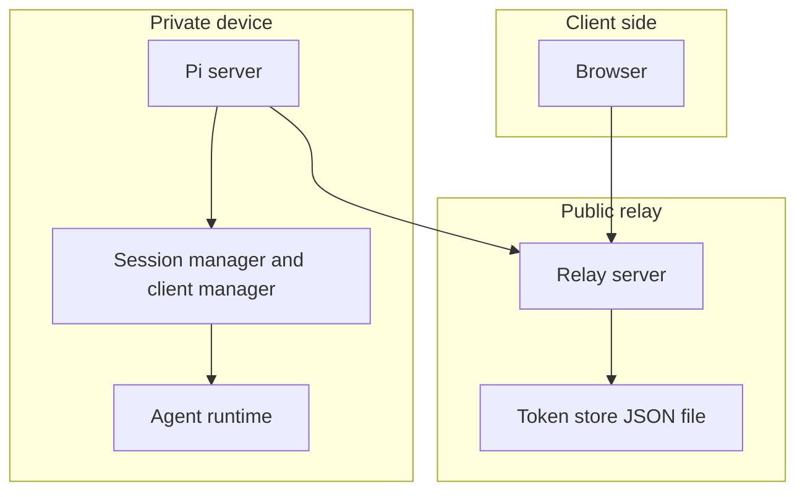

# Part 1: Topology And Runtime Model

## 1. Relay Process Shape

The relay process starts in `runRelayServer()` in `apps/relay-server/src/index.ts`.

It is built directly on Node's `http.createServer()` and does not use Express, Fastify, WebSocket libraries, or an SSE helper package.

At runtime it creates three important local objects:

- `tokenStore`: persistent token store backed by a JSON file.
- `browserClients`: in-memory map of active browser SSE connections keyed by `clientId`.
- `agentConnections`: in-memory map of active Pi server SSE connections keyed by `agentId`.

That means the relay owns only transport state, not application session state.

## 2. What The Relay Owns vs What The Pi Server Owns

The relay owns:

- authentication and token verification
- owner-bound browser-to-agent token targeting
- live transport registration
- forwarding browser events to the Pi server
- forwarding Pi server messages back to the browser

The Pi server owns:

- session creation and session lifecycle
- transcript state
- chat message handling
- tool execution and agent runtime
- job and admin APIs

So the relay is a message broker and authorization gate, not the business-logic server.

## 3. Static Topology

## 4. Why The Architecture Looks Like This

The old model depended on the relay calling back into a public `serverUrl` for the Pi server.

That breaks down when the Pi server runs on a laptop or on `localhost`, because the public relay cannot reliably open inbound HTTP requests into a private machine.

The current model fixes that by making the Pi server open an outbound authenticated SSE stream to the relay.

This inverts connectivity in the useful direction:

- the private machine dials out
- the public relay only talks over already-open channels
- the browser keeps stable relay-facing URLs

## 5. Runtime Maps And Their Meaning

The relay keeps two maps in memory.

### `BrowserClients`

Each entry stores:

- `clientId`
- paired `agentId`
- `closed` flag
- `send(payload)` function that writes SSE chunks to the browser response
- `close(reason)` function that tears down the stream and notifies the paired agent

### `agentConnections`

Each entry stores:

- `agentId`
- `closed` flag
- `send(command)` function that writes SSE chunks to the Pi server response
- `close(reason)` function that tears down the agent stream and closes all relay-backed browser clients attached to that agent

This is why the relay behaves like a small in-memory broker node.

## 6. Core Runtime Rule

The relay only forwards traffic when all of the following are true:

1. the caller presents a valid relay token
2. the token exists in the token store
3. the token is scoped to the expected peer type
4. the target binding is consistent with the token
5. the destination live connection currently exists in memory

#### If any one of those breaks, the relay returns an auth or availability error instead of queueing traffic.
