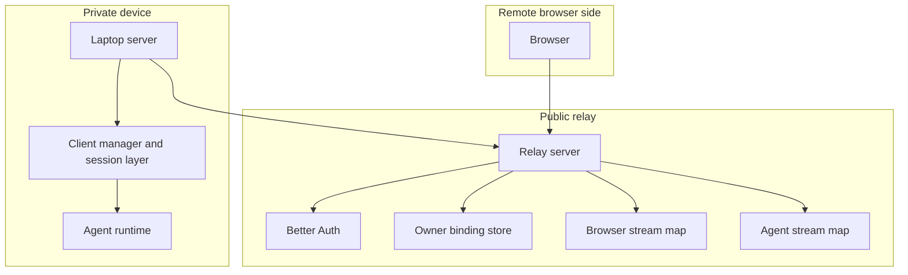

# Part 1: Topology And Runtime Model

## 1. Relay Process Shape

The relay process starts in `runRelayServer()` in `./apps/relay-server/src/index.ts`.

It is built directly on Node's `http.createServer()` and wires request handling through `createRelayRequestHandler()` in `apps/relay-server/src/relay/routes.ts`.

At runtime it creates one `RelayServerState` with four important pieces of state:

- `ownerBindingStore`: durable owner-to-agent bindings backed by a JSON file
- `browserClients`: in-memory map of active browser SSE connections keyed by `clientId`
- `agentConnections`: in-memory map of active agent SSE connections keyed by `agentId`
- `agentSessions`: in-memory map of recently authenticated agent JWT payloads used for readiness checks

That means the relay owns auth and transport state, but not the real application session runtime.

## 2. What The Relay Owns vs What The Laptop Server Owns

The relay owns:

- Better Auth session handling for signed-in browsers
- owner-to-agent linking
- relay JWT issuance and verification
- target scoping for client and agent traffic
- live transport registration
- forwarding browser events to the laptop server
- forwarding laptop-server messages back to the browser

The laptop server owns:

- session creation and lifecycle
- transcript state
- chat message handling
- tool execution
- jobs and admin APIs
- local provider and MCP state

So the relay is a public broker and authorization layer, not the business-logic server.

## 3. Static Topology

## 4. Why The Architecture Looks Like This

The old model depended on the relay calling back into a public `serverUrl` for the user's device.

That breaks down when the real server runs on a laptop, on `localhost`, or behind NAT where the public relay cannot reliably open inbound requests.

The current model fixes that by making the laptop server open an outbound authenticated SSE stream to the relay.

That gives the system the useful direction of connectivity:

- the private machine dials out
- the public browser dials out
- the public relay brokers between already-open channels

## 5. Runtime Maps And Their Meaning

### `browserClients`

Each entry represents one active remote browser SSE stream.

Each entry stores:

- `clientId`
- paired `agentId`
- `closed` flag
- `send(payload)` for writing SSE data to the browser
- `close(reason)` for tearing down the stream and notifying the paired agent

### `agentConnections`

Each entry represents one active laptop-server SSE stream.

Each entry stores:

- `agentId`
- `closed` flag
- `send(command)` for writing relay commands to the laptop server
- `close(reason)` for tearing down the stream and closing all relay-backed browser clients attached to that agent

### `agentSessions`

This is not a live transport map.

It is an in-memory record of the latest issued agent auth payload for an `agentId`.

The relay uses it mainly for heartbeat readiness checks, so the remote browser can distinguish:

- a linked server that authenticated recently
- a linked server that also has a live transport stream right now

## 6. Core Runtime Rule

The relay forwards traffic only when all of the following are true:

1. the caller presents a valid relay credential
2. the credential is the correct peer type for that endpoint
3. the target direction is valid
4. the target binding is consistent with the token scope
5. the destination live connection currently exists in memory

If any one of those conditions fails, the relay returns an auth or availability error instead of queueing traffic.

## 7. The Relay Is Stateful, But Narrowly

The relay is stateful in an intentionally narrow way.

It remembers enough to broker live traffic:

- who is linked to whom
- which browser streams are open
- which agent streams are open
- whether an agent authenticated recently enough to be considered ready

It does **not** remember the app session itself.

If the relay restarts:

- live browser streams are lost
- live agent streams are lost
- in-memory `agentSessions` are lost
- owner bindings survive because they are the only relay state persisted to disk
