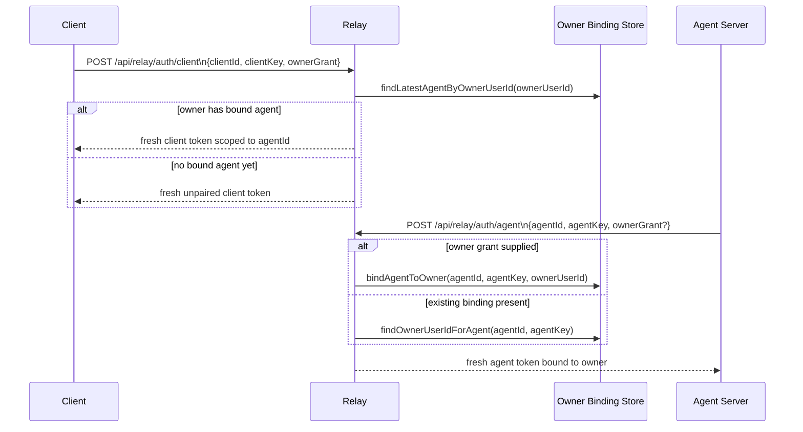

# Part 2: Auth And Owner Binding

## 1. Shared Contract

The public relay routes and relay protocol types are defined in `apps/shared/src/index.ts`.

The most important pieces are:

- `RELAY_CLIENT_AUTH_PATH`
- `RELAY_CLIENT_HEARTBEAT_PATH`
- `RELAY_AGENT_AUTH_PATH`
- `RELAY_AGENT_STREAM_PATH`
- `RELAY_AGENT_MESSAGE_PATH`
- `RELAY_CONNECTION_PATH`
- `RelayAgentCommand`
- `RelayAgentMessage`

That shared package keeps the browser, relay, and Pi server on one explicit protocol.

## 2. JWT Model

JWT generation and verification live in `apps/relay-server/src/auth.ts`.

The relay accepts only two principal types:

- `client`
- `agent`

The validated payload shape is:

```ts
type AuthTokenPayload = {
  type: "client" | "agent";
  id: string;
  key: string;
  targetId?: string;
  targetType?: "client" | "agent";
  ownerUserId?: string;
  serverUrl?: string;
  iat: number;
  exp: number;
}
```

Important details:

- `id` is the stable principal identity.
- `key` is the stable credential used to reissue tokens for that same principal.
- `targetId` and `targetType` scope the token to a specific peer.
- `ownerUserId` binds the principal to the Better Auth account that owns it.
- `iat` and `exp` are required and validated.

The relay uses HS256 and issues short-lived transport tokens with a 1 hour TTL.

## 3. Owner Binding Store Design

`apps/relay-server/src/owner-binding-store.ts` persists only the minimal owner-to-agent binding state needed for pairing and agent re-authentication.

Default path behavior:

- `RELAY_OWNER_BINDING_STORE_PATH` if configured
- otherwise legacy `RELAY_TOKEN_STORE_PATH` as a compatibility fallback
- otherwise a path derived from the legacy sqlite setting if present
- otherwise `.data/relay-owner-bindings.json` in the current working directory

The file stores structured agent bindings rather than issued JWT history.

Each binding records:

- `agentId`
- `agentKey`
- `ownerUserId`
- `updatedAt`

## 4. Client Authentication Flow

The browser client calls `POST /api/relay/auth/client` with:

```json
{
  "clientId": "client-...",
  "clientKey": "key-...",
  "ownerGrant": "signed-owner-grant"
}
```

The relay then:

1. resolves the owner from the Better Auth session or the supplied owner grant
2. looks up the latest agent binding for that `ownerUserId`
3. issues a fresh client transport token scoped to that agent when a binding exists
4. otherwise issues a fresh unpaired client transport token
5. returns token, expiry, targeting state, and target data

The browser identity is durable on the client side. The web app stores only `clientId` and `clientKey` in local storage in `apps/web/src/relay-auth.ts`; issued client tokens are not persisted.

## 5. Agent Authentication Flow

The Pi server calls `POST /api/relay/auth/agent` with:

```json
{
  "agentId": "agent-...",
  "agentKey": "key-...",
  "ownerGrant": "signed-owner-grant"
}
```

The relay then:

1. validates the short-lived owner grant issued by the relay to a signed-in browser, when present
2. persists or reuses the `agentId` + `agentKey` -> `ownerUserId` binding
3. issues a fresh agent transport token with `ownerUserId` set to that Better Auth user
4. returns the agent token for the local server to use when opening the relay SSE transport

The local server persists only its stable agent identity (`agentId` and `agentKey`) in `apps/server/src/relay-auth.ts`; issued agent tokens are not persisted.

## 6. Owner-Binding Lifecycle Diagram



## 7. Connection Authorization Check

The endpoint `POST /api/relay/connection` is a lightweight authorization verifier.

The Pi server uses it through `verifyRelayClientAccess()` in `apps/server/src/relay-auth.ts`.

The flow is:

1. a browser request arrives at the Pi server
2. the Pi server extracts the relay client token
3. the Pi server asks the relay whether this token is allowed to target this exact `agentId`
4. the relay validates peer type and target scope
5. the Pi server accepts the browser as authenticated only if the relay confirms the binding

This keeps the Pi server from trusting browser relay tokens locally without relay-side scope verification.

## 8. Important Constraint

Persistent owner binding is the source of truth for pairing. Issued relay tokens are transport credentials only.

That means:

- pairing comes from shared OAuth owner identity
- relay request authentication relies on JWT verification and token scope
- the relay does not persist issued JWT history as part of token validity
