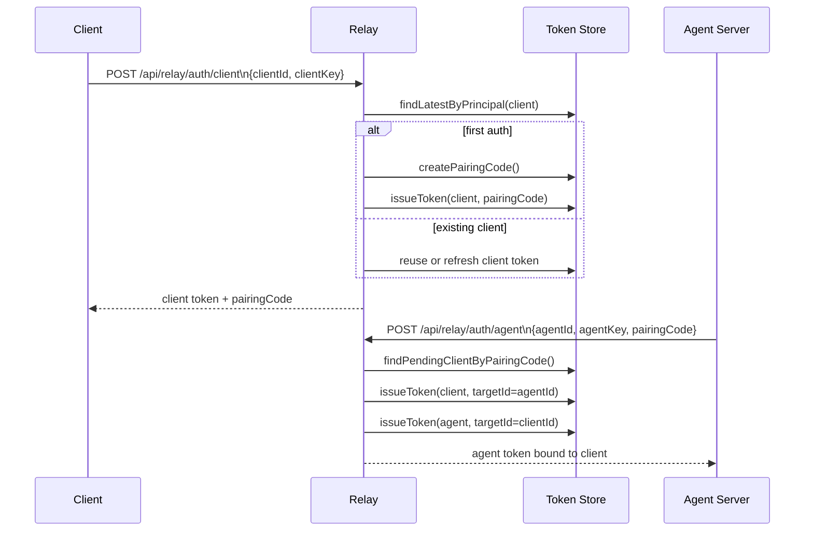

# Part 2: Auth And Pairing

## 1. Shared Contract

The public relay routes and relay protocol types are defined in `apps/shared/src/index.ts`.

The most important pieces are:

- `RELAY_CLIENT_AUTH_PATH`
- `RELAY_CLIENT_HEARTBEAT_PATH`
- `RELAY_AGENT_AUTH_PATH`
- `RELAY_AGENT_STREAM_PATH`
- `RELAY_AGENT_MESSAGE_PATH`
- `RELAY_CONNECTION_PATH`
- `RelayAgentCommand`
- `RelayAgentMessage`

That shared package keeps the browser, relay, and Pi server on one explicit protocol.

## 2. JWT Model

JWT generation and verification live in `apps/relay-server/src/auth.ts`.

The relay accepts only two principal types:

- `client`
- `agent`

The validated payload shape is:

```ts
type AuthTokenPayload = {
  type: "client" | "agent";
  id: string;
  key: string;
  pairingCode?: string;
  targetId?: string;
  targetType?: "client" | "agent";
  serverUrl?: string;
  iat: number;
  exp: number;
}
```

Important details:

- `id` is the stable principal identity.
- `key` is the stable credential used to reissue tokens for that same principal.
- `targetId` and `targetType` scope the token to a specific peer.
- `pairingCode` exists mainly for unpaired or newly paired flows.
- `iat` and `exp` are required and validated.

The relay uses HS256 and currently issues long-lived tokens with a 180 day TTL.

## 3. Token Store Design

`apps/relay-server/src/token-store.ts` stores issued tokens as raw JWT strings in a JSON file.

Default path behavior:

- `RELAY_TOKEN_STORE_PATH` if configured
- otherwise a path derived from the legacy sqlite setting if present
- otherwise `.data/relay-issued-tokens.json` in the current working directory

The store does not persist expanded state objects. It persists token strings and reparses them on read.

That gives the store a simple model:

- load token strings
- verify and parse them when needed
- ignore malformed or expired tokens unless explicitly allowed
- sort valid entries by newest `iat`

## 4. Client Authentication Flow

The browser or mobile client calls `POST /api/relay/auth/client` with:

```json
{
  "clientId": "client-...",
  "clientKey": "key-..."
}
```

The relay then:

1. looks for the newest token for that `clientId` and `clientKey`
2. refreshes it if it is near expiry
3. otherwise issues a new token if none exists
4. creates a pairing code if the client is still unpaired
5. returns token, expiry, pairing state, and target data

The browser identity is durable on the client side. The web app stores `clientId` and `clientKey` in local storage in `apps/web/src/relay-auth.ts`.

## 5. Agent Authentication Flow

The Pi server calls `POST /api/relay/auth/agent` with:

```json
{
  "agentId": "agent-...",
  "agentKey": "key-...",
  "pairingCode": "ABCDEFGH"
}
```

The relay then:

1. finds the pending client for that pairing code
2. reissues the client token with `targetId = agentId` and `targetType = "agent"`
3. issues or refreshes the agent token with `targetId = clientId` and `targetType = "client"`
4. returns the agent token bound to that client

If the agent was already paired to a different client, the relay clears the old client target by issuing that old client a new unpaired token with a new pairing code.

## 6. Pairing Lifecycle Diagram



## 7. Connection Authorization Check

The endpoint `POST /api/relay/connection` is a lightweight authorization verifier.

The Pi server uses it through `verifyRelayClientAccess()` in `apps/server/src/relay-auth.ts`.

The flow is:

1. a browser request arrives at the Pi server
2. the Pi server extracts the relay client token
3. the Pi server asks the relay whether this token is allowed to target this exact `agentId`
4. the relay validates peer type and target scope
5. the Pi server accepts the browser as authenticated only if the relay confirms the binding

This keeps the Pi server from trusting browser relay tokens locally without relay-side scope verification.

## 8. Important Constraint

A token is not enough by itself. The relay requires the token to also be present in its token store.

That means the relay treats stored issuance as part of validity, not just signature correctness.