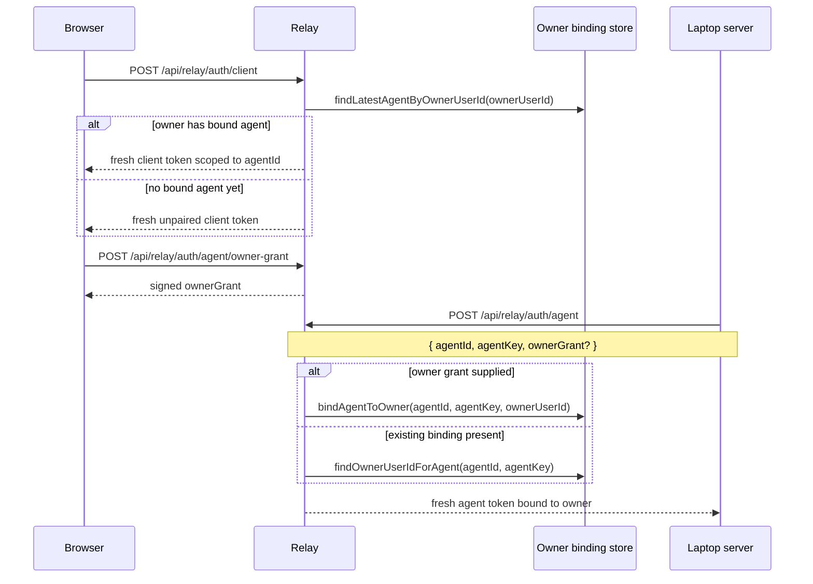

# Part 2: Auth And Pairing

## 1. Shared Contract

The public relay routes and relay protocol types are defined in `apps/shared/src/index.ts`.

The most important auth-related pieces are:

- `RELAY_CLIENT_AUTH_PATH`
- `RELAY_CLIENT_HEARTBEAT_PATH`
- `RELAY_AGENT_OWNER_GRANT_PATH`
- `RELAY_AGENT_AUTH_PATH`
- `RELAY_CONNECTION_PATH`
- `RelayClientAuthRequest`
- `RelayAgentAuthRequest`
- `RelayConnectionRequest`

That shared package keeps the browser, relay, and laptop server on one explicit protocol.

## 2. Better Auth And Owner Identity

The relay is the public auth surface.

When Better Auth is configured, the relay resolves the signed-in owner from the browser session cookie through `apps/relay-server/src/better-auth.ts`.

That owner identity is the account-level link between:

- a signed-in browser
- a laptop agent identity
- future browser auth requests for the same owner

So the pairing story is fundamentally owner-based, not direct browser-to-laptop registration.

## 3. JWT Model

JWT generation and verification live in `apps/relay-server/src/auth.ts`.

The relay accepts only two principal types:

- `client`
- `agent`

The validated payload shape is:

```ts
type AuthTokenPayload = {
  type: "client" | "agent";
  id: string;
  key: string;
  targetId?: string;
  targetType?: "client" | "agent";
  serverUrl?: string;
  ownerUserId?: string;
  iat: number;
  exp: number;
}
```

Important details:

- `id` is the stable principal identity.
- `key` is the stable credential used to reissue tokens for that same principal.
- `targetId` and `targetType` scope the token to a specific peer.
- `ownerUserId` binds the principal to the Better Auth account that owns it.
- `iat` and `exp` are required and validated.

The relay uses HS256 and currently issues transport tokens with a 1 hour TTL.

## 4. Owner Grant Model

The relay also issues a short-lived owner grant used only when linking a laptop server to a signed-in owner account.

That payload looks like:

```ts
type OwnerAgentGrantPayload = {
  purpose: "agent_owner_grant";
  ownerUserId: string;
  iat: number;
  exp: number;
}
```

The grant is requested through `POST /api/relay/auth/agent/owner-grant` and is verified by the relay when the laptop later calls `POST /api/relay/auth/agent`.

## 5. Owner Binding Store Design

`apps/relay-server/src/owner-binding-store.ts` persists the minimal owner-to-agent binding state needed for pairing and future agent re-authentication.

Default path behavior:

- `RELAY_OWNER_BINDING_STORE_PATH` if configured
- otherwise legacy `RELAY_TOKEN_STORE_PATH` as a compatibility fallback
- otherwise a path derived from the legacy sqlite setting if present
- otherwise `.data/relay-owner-bindings.json` in the current working directory

Each stored binding records:

- `agentId`
- `agentKey`
- `ownerUserId`
- `updatedAt`

This store is the durable source of truth for pairing.

## 6. Client Authentication Flow

The browser client calls `POST /api/relay/auth/client` with:

```json
{
  "clientId": "client-...",
  "clientKey": "key-...",
  "ownerGrant": "optional-signed-owner-grant"
}
```

The relay then:

1. resolves the owner from the Better Auth session or the supplied owner grant
2. looks up the latest agent binding for that `ownerUserId`
3. issues a fresh client token scoped to that agent when a binding exists
4. otherwise issues a fresh unpaired client token
5. returns the token, expiry, and current target information

The browser stores only its durable client identity in `apps/web/src/relay-auth.ts`. It does not persist the issued relay JWT.

## 7. Agent Authentication Flow

The laptop server calls `POST /api/relay/auth/agent` with:

```json
{
  "agentId": "agent-...",
  "agentKey": "key-...",
  "ownerGrant": "optional-signed-owner-grant"
}
```

The relay then:

1. validates the owner grant when one is supplied
2. otherwise tries to restore the owner binding from the stored `agentId` + `agentKey`
3. writes or reuses the owner binding
4. issues a fresh agent transport token with `ownerUserId` set
5. records that issued payload in the relay's in-memory `agentSessions` map
6. returns the agent token for the laptop server to use when opening the SSE transport

The laptop server persists only its stable `agentId` and `agentKey` in `apps/server/src/relay-auth.ts`. It does not persist the issued relay JWT.

## 8. Owner-Binding Lifecycle Diagram



## 9. Connection Authorization Check

`POST /api/relay/connection` is a lightweight authorization verifier.

The laptop server uses it through `verifyRelayClientAccess()` in `apps/server/src/relay-auth.ts`.

The flow is:

1. a browser request arrives at the laptop server through the remote path
2. the laptop server extracts the relay client token
3. the laptop server asks the relay whether this token is allowed to target this exact `agentId`
4. the relay checks principal type, target direction, and target scope
5. the laptop server accepts the browser only if the relay confirms the binding

This keeps target scoping enforced centrally by the relay.

## 10. Important Constraint

The relay does **not** persist issued JWT history as a token store.

Instead:

- durable pairing comes from owner-to-agent bindings
- issued transport JWTs are self-verifying short-lived credentials
- readiness is derived from in-memory `agentSessions` and live `agentConnections`

That distinction is important because it explains why pairing survives restarts but live availability does not.
