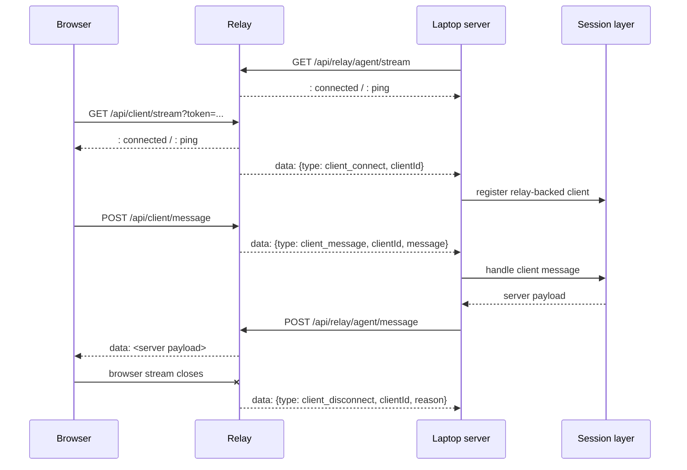

# Part 3: HTTP, SSE, And Session Handoff

## 1. Why The Transport Is Split

The relay does not use WebSockets.

Instead it composes bidirectional messaging from two primitives:

- SSE for server-to-client delivery
- JSON POST for client-to-server delivery

That pattern exists on both sides of the relay.

### Browser side

- downlink: `GET /api/client/stream`
- uplink: `POST /api/client/message`

### Laptop server side

- downlink: `GET /api/relay/agent/stream`
- uplink: `POST /api/relay/agent/message`

So the relay is bridging two half-duplex transport pairs.

## 2. Browser Stream Registration

Browser stream setup lives in `registerBrowserClientStream()` in `apps/relay-server/src/relay/transports.ts`.

The relay:

1. resolves the browser target from the relay client token
2. verifies the token is for a `client`
3. verifies the client token is paired to an `agent`
4. opens an SSE response
5. stores a `RelayBrowserClientConnection` in `browserClients`
6. sends a `client_connect` command to the paired agent stream

The SSE response headers are explicitly set to:

- `cache-control: no-store`
- `connection: keep-alive`
- `content-type: text/event-stream; charset=utf-8`
- `x-accel-buffering: no`

The relay then writes:

- `: connected` once at stream start
- `: ping` every 15 seconds as an SSE comment heartbeat

If another stream opens for the same `clientId`, the old one is closed and replaced.

## 3. Agent Stream Registration

Agent stream setup lives in `handleAgentStreamRequest()` in `apps/relay-server/src/relay/transports.ts`.

The relay:

1. reads the bearer token
2. verifies that it is an `agent` token
3. opens an SSE response to the laptop server
4. stores a `RelayAgentConnection` in `agentConnections`
5. replays `client_connect` for any browser clients already paired to that agent

This replay matters because it lets the laptop server rebuild relay-backed client connection state after reconnecting its agent stream.

## 4. Relay Event Shapes

The relay sends commands from relay to laptop server as `RelayAgentCommand`:

```ts
type RelayAgentCommand =
  | { type: "client_connect"; clientId: string }
  | { type: "client_disconnect"; clientId: string; reason?: string }
  | { type: "client_message"; clientId: string; message: unknown }
```

The laptop server sends messages back to the relay as `RelayAgentMessage`:

```ts
type RelayAgentMessage = {
  type: "server_message";
  clientId: string;
  message: unknown;
}
```

## 5. How SSE Is Encoded

The relay manually formats SSE frames:

- payload frame: `data: <json>\n\n`
- heartbeat comment: `: ping\n\n`

No event names, ids, or resume cursors are used.

That means the stream is intentionally simple:

- JSON payloads only
- comments for keepalive
- no replay support
- no resumable cursor protocol

## 6. Live Message Flow



## 7. Browser To Relay To Laptop Server

`handleClientMessageRequest()` in `apps/relay-server/src/relay/transports.ts` receives browser POST messages.

The relay first resolves the browser target from the token. Then it verifies that the browser stream is already connected.

That is a deliberate rule: posting messages is not enough. The relay expects the browser's receive path to be alive too.

If that check passes, the relay forwards a `client_message` command over the agent SSE stream.

If the agent stream is unavailable, the relay returns an availability failure instead of buffering.

## 8. Laptop Server To Relay To Browser

The laptop server posts browser-visible messages through `postRelayServerMessage()` in `apps/server/src/web/relay.ts`.

That function performs an authenticated `POST /api/relay/agent/message`.

The relay then:

1. verifies the agent token
2. parses the payload as `server_message`
3. finds the browser client by `clientId`
4. verifies the client belongs to that agent
5. writes the payload directly into the browser SSE stream

If the target browser stream is gone, the relay returns a conflict response.

## 9. Where Session Handling Starts

The real session handoff is on the laptop server, not inside the relay.

In `apps/server/src/web/relay.ts`:

- `handleRelayAgentCommand()` receives `client_connect`, `client_disconnect`, and `client_message`
- `ensureRelayClientConnection()` registers a relay-backed client transport in the laptop server's client manager
- `handleClientMessage()` is where a relay-forwarded browser message enters the normal server-side session pipeline

So the relay does not have a dedicated session handler. It hands transport events to the laptop server, and the laptop server reuses its existing local client and session machinery.

## 10. Laptop Server Stream Consumer

The laptop server consumes the relay agent stream in `consumeRelayAgentStream()` in `apps/server/src/web/relay.ts`.

It uses the Fetch API stream reader directly:

1. `fetch()` the relay agent SSE endpoint
2. get `response.body.getReader()`
3. decode bytes with `TextDecoder`
4. accumulate text into a buffer
5. split SSE events on blank-line boundaries
6. collect `data:` lines
7. JSON-parse them into `RelayAgentCommand`
8. dispatch them into the local relay adapter

That is a fully manual SSE consumer on the server side.

## 11. Reconnect Behavior

The laptop server runs a reconnect loop in `runRelayTransportLoop()`.

If the agent SSE stream ends or errors:

- relay-backed client connections are removed on the laptop server
- the laptop server waits `RELAY_STREAM_RETRY_MS`
- the laptop server reconnects using the same durable agent identity and a refreshed token when needed

This is a small generation-based reconnect design rather than a full transport supervisor.
