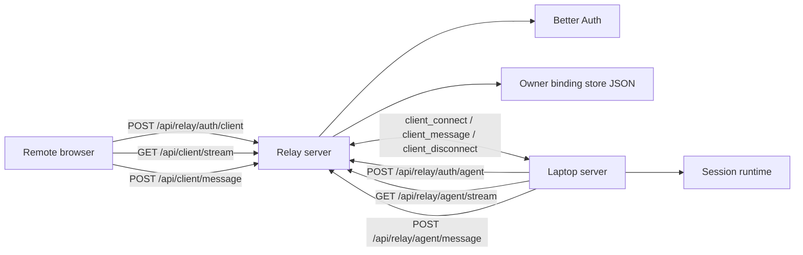

# Relay Server Architecture

This document set explains how the relay works in the current codebase.

It is based on the implementation in:

- `apps/relay-server/src/index.ts`
- `apps/relay-server/src/auth.ts`
- `apps/relay-server/src/better-auth.ts`
- `apps/relay-server/src/owner-binding-store.ts`
- `apps/relay-server/src/relay/routes.ts`
- `apps/relay-server/src/relay/transports.ts`
- `apps/relay-server/src/relay/authorization.ts`
- `apps/relay-server/src/relay/responses.ts`
- `apps/relay-server/src/relay/state.ts`
- `apps/shared/src/index.ts`
- `apps/server/src/relay-auth.ts`
- `apps/server/src/web/relay.ts`
- `apps/web/src/relay-auth.ts`

## Reading Order

1. `01-topology-and-runtime-model.md`
2. `02-auth-and-pairing.md`
3. `03-http-sse-transport-and-session-handoff.md`
4. `04-endpoints-state-and-failure-modes.md`

## One-Screen Summary

The relay is a public HTTP plus SSE broker.

It does **not** run the real chat or agent session logic. That runtime stays on the user's laptop in `apps/server`.

The relay does four main things:

1. Hosts Better Auth and Google OAuth for signed-in browser sessions.
2. Links browser users and laptop agents to the same owner account.
3. Issues short-lived JWT transport credentials for clients and agents.
4. Holds live in-memory browser and agent connections, then forwards messages between them.

## High-Level Topology

## Important Framing

- The relay is stateful for live transports, but only in memory.
- The relay persists owner-to-agent bindings, not issued JWT history.
- Browser-to-relay and relay-to-agent traffic are both built from SSE downlink plus HTTP POST uplink.
- If either side disconnects, the relay tears down the live path and waits for reconnect.
- Some `serverUrl` fields still exist in auth types for compatibility, but the active runtime path is the SSE-based broker flow.
