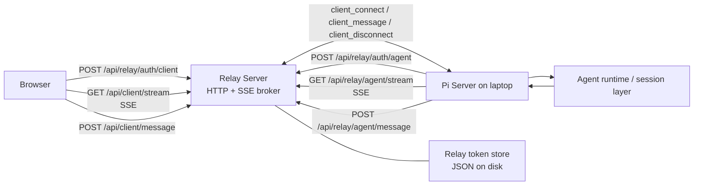

# Relay Server Architecture

This document set explains how the relay server works in the current codebase.

It is based on the implementation in:

- `apps/relay-server/src/index.ts`
- `apps/relay-server/src/auth.ts`
- `apps/relay-server/src/token-store.ts`
- `apps/shared/src/index.ts`
- `apps/server/src/relay-auth.ts`
- `apps/server/src/web-relay.ts`
- `apps/server/src/web.ts`
- `apps/web/src/relay-auth.ts`

## Reading Order

1. `01-topology-and-runtime-model.md`
2. `02-auth-and-pairing.md`
3. `03-http-sse-transport-and-session-handoff.md`
4. `04-endpoints-state-and-failure-modes.md`

## One-Screen Summary

The relay server is an authenticated HTTP plus SSE broker.

It does **not** run the real agent session logic. The real session runtime stays on the Pi server in `apps/server`.

The relay does four things:

1. Issues and validates relay JWTs for clients and agents.
2. Binds browser clients and laptop agents to the same owner account, then targets clients to the active agent for that owner.
3. Holds live in-memory connections for browser streams and agent streams.
4. Forwards client connect, disconnect, and message events between the browser side and the Pi server side.

## High-Level Topology

## Important Framing

- The relay is stateful for live connections, but only in memory.
- The relay is durable for issued tokens, but only through a JSON file on disk.
- The transport is bidirectional only by composition: SSE for downlink plus HTTP POST for uplink.
- If either the browser stream or the agent stream disappears, the relay tears down the corresponding live path and waits for reconnect.
- The current design replaced the older callback-to-`serverUrl` model. Some `serverUrl` fields remain in token structures, but the active runtime path is stream brokering.
