# Relay Server Flows

This document maps the actual flow inside `apps/relay-server` so the code in
`src/` is easier to trace.

## 1. High-level architecture

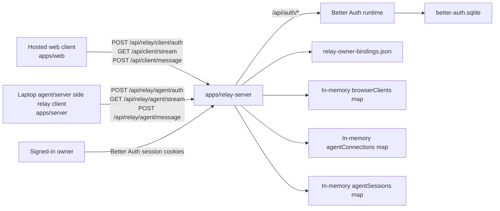

## 2. Relay bootstrap

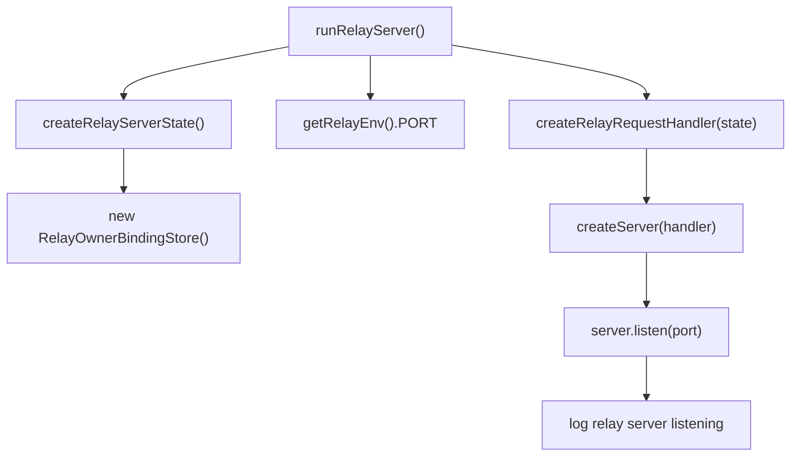

## 3. Better Auth request flow

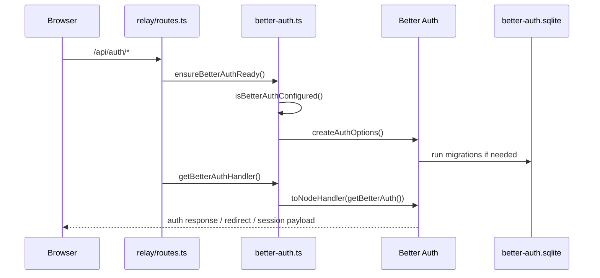

## 4. Owner grant and agent binding flow

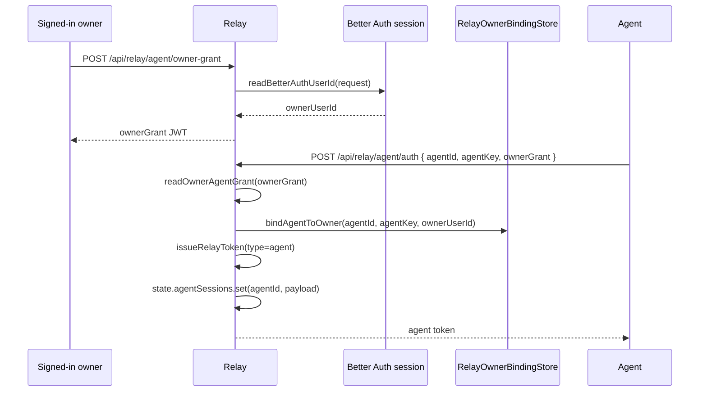

## 5. Client auth and pairing flow

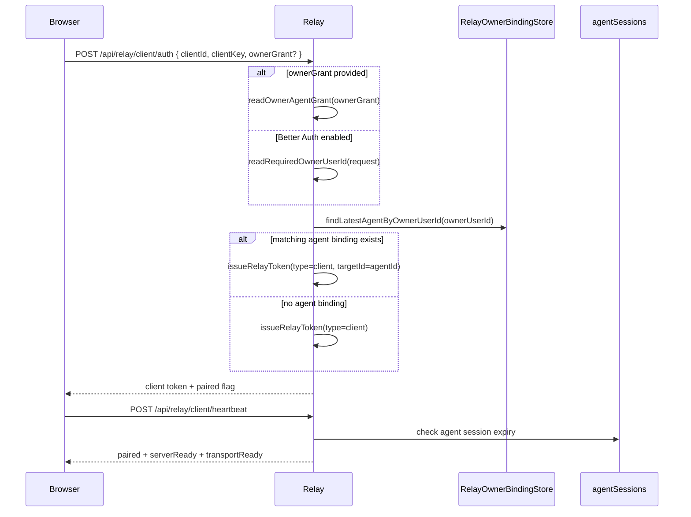

## 6. Browser SSE registration flow

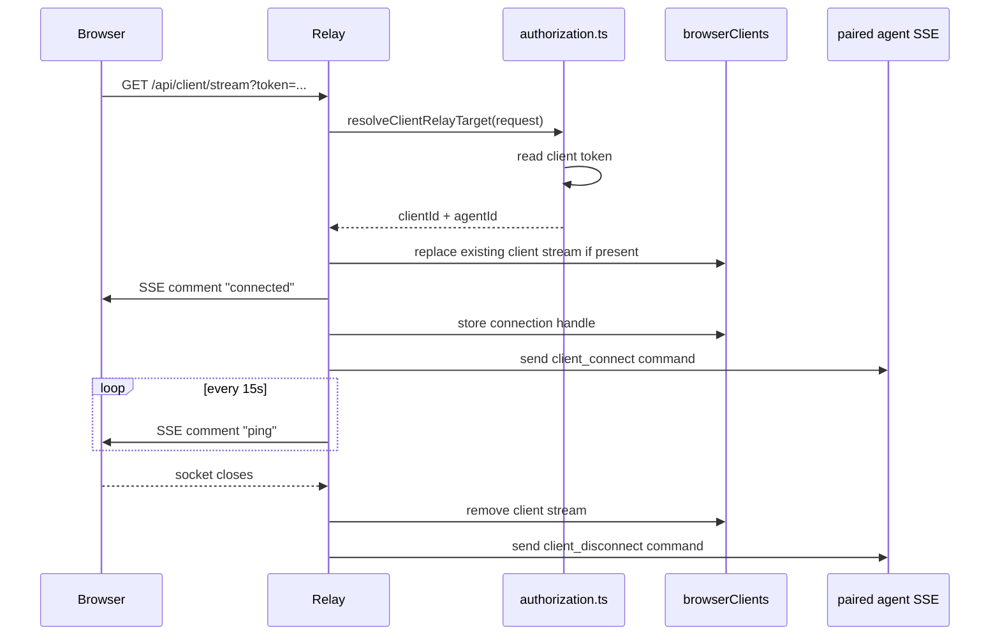

## 7. Agent SSE registration flow

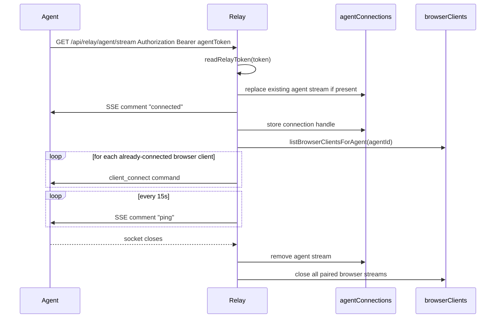

## 8. Browser message to agent flow

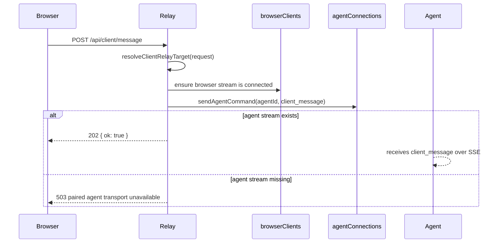

## 9. Agent message to browser flow

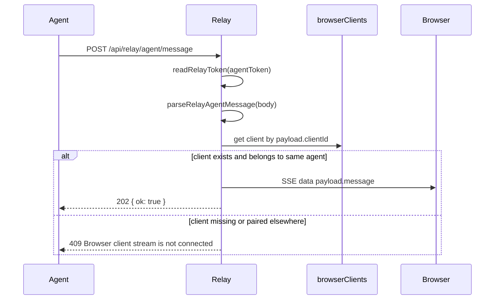

## 10. Generic connection authorization flow

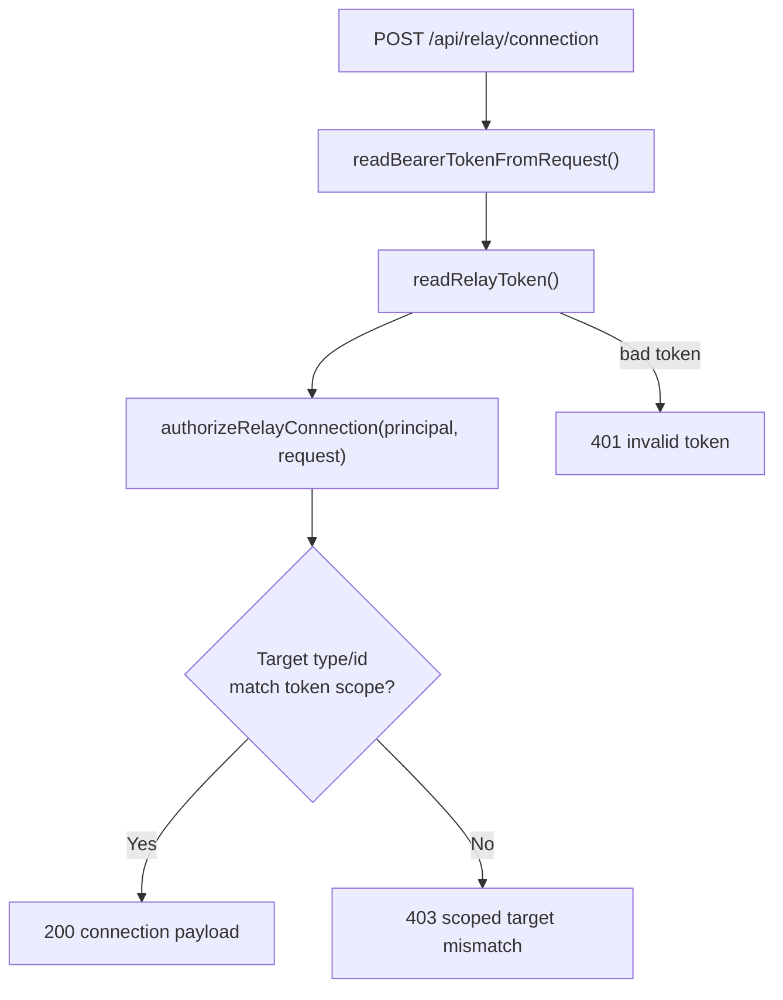

## 11. Route ownership map

```mermaid
flowchart TD
    Routes["createRelayRequestHandler()"] --> AuthRoutes["/api/auth/* -> Better Auth handler"]
    Routes --> Health["/ and /health -> buildHealthPayload"]
    Routes --> ClientAuth["/api/relay/client/auth -> parseClientAuthRequest + issueClientToken"]
    Routes --> ClientHeartbeat["/api/relay/client/heartbeat -> buildClientHeartbeatResponse"]
    Routes --> OwnerGrant["/api/relay/agent/owner-grant -> generateOwnerAgentGrant"]
    Routes --> AgentAuth["/api/relay/agent/auth -> parseAgentAuthRequest + issueAgentToken"]
    Routes --> AgentStream["/api/relay/agent/stream -> handleAgentStreamRequest"]
    Routes --> AgentMessage["/api/relay/agent/message -> handleAgentMessageRequest"]
    Routes --> ClientStream["/api/client/stream -> registerBrowserClientStream"]
    Routes --> ClientMessage["/api/client/message -> handleClientMessageRequest"]
    Routes --> Connection["/api/relay/connection -> authorizeRelayConnection"]
```
